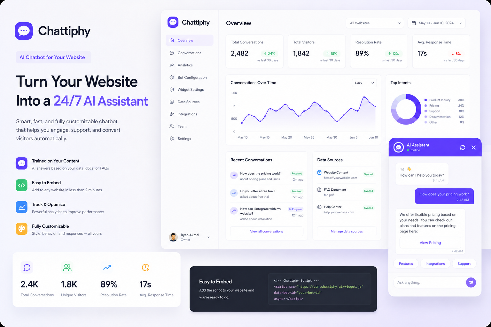
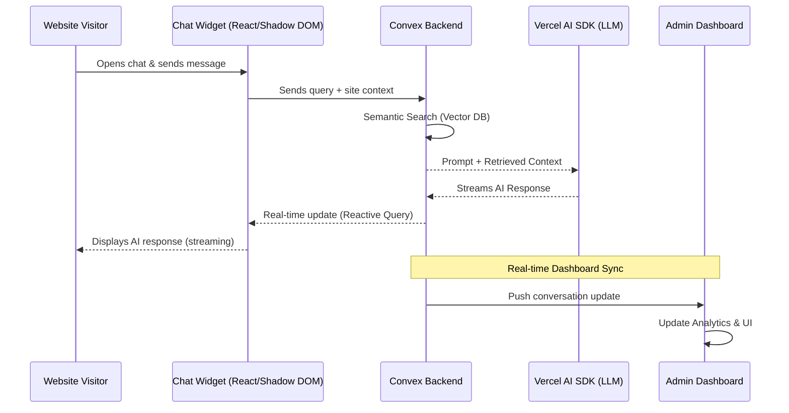

# <p align="center">Chattiphy</p>

<p align="center">
  <strong>The Ultimate AI Chat Experience for Your Website in Minutes.</strong>
</p>

<p align="center">
  
  
  
  
  
  
</p>

---

## Mockup Overview



---

## What is Chattiphy?

Chattiphy is a high-performance, SaaS-ready AI chatbot platform that enables businesses to deploy intelligent, context-aware assistants in seconds. Unlike generic chatbots, Chattiphy is trained on your specific data, providing accurate and branded responses to your visitors 24/7.

- **Instant Deployment:** Go from zero to a live AI widget with one line of code.
- **Context-Aware:** Upload PDFs, documents, or URLs to build a custom knowledge base.
- **Modern Tech Stack:** Built with Next.js 16, React 19, and Convex for sub-millisecond reactivity.
- **Enterprise Grade:** Secure authentication via Clerk and scalable vector search.

---

## How It Works

1.  **Ingest Knowledge:** Upload your business documents. Chattiphy's backend (Convex) chunks and embeds this data into a high-dimensional vector space.
2.  **Configure Persona:** Tailor the bot’s name, tone, and welcome message to match your brand identity.
3.  **Embed Widget:** Copy the generated script tag and paste it into your website’s HTML.
4.  **Engage & Analyze:** Watch conversations happen in real-time on your dashboard and optimize based on visitor interaction.

---

## App Flow & Architecture

Below is a detailed overview of how data flows through the Chattiphy ecosystem:



---

## Getting Started

### Prerequisites

- **Node.js:** 20.x or higher
- **Package Manager:** `pnpm`
- **Accounts:** Clerk (Auth), Convex (Backend), and OpenAI/Anthropic (LLM API).

### Local Installation

1. **Clone the repository:**

   ```bash
   git clone https://github.com/your-repo/chattiphy.git
   cd chattiphy
   ```

2. **Install dependencies:**

   ```bash
   pnpm install
   ```

3. **Set up environment variables:**
   - Create `.env.local` in `apps/web` and `packages/backend`.
   - Add your Clerk and Convex credentials.

4. **Run the development server:**
   ```bash
   # Start all services (Web, Backend, Widget)
   pnpm dev
   ```

---

## Project Structure

- `apps/web`: The main SaaS dashboard and landing page.
- `apps/widget`: The client-side chat widget (injectable).
- `packages/backend`: Convex backend logic, schemas, and AI actions.
- `packages/ui`: Shared component library built with Tailwind CSS 4.

